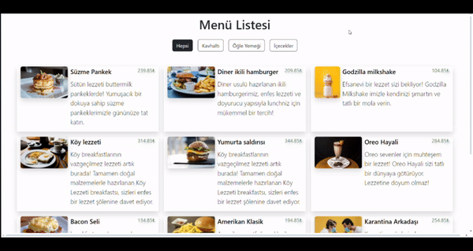

---

# Kafe Menü Listesi Uygulaması

Bu proje, bir kafe için HTML, CSS ve JavaScript kullanılarak hazırlanmış basit bir çok sayfalı web sitesidir. Web sitesi, yiyecek ve içecek ürün kategorilerini içerir. Kullanıcılar bir kategoriye tıkladığında o kategoriye ait ürünler listelenir ve ürün üzerine tıklanıldığında ürünün detay sayfası açılır.

## Özellikler

- **Ana Sayfa**: Kafe menü listesi ve öne çıkan ürünlerin bulunduğu giriş sayfası.
- **Ürün Kategorileri**: Yiyecek ve içecek kategorilerine ayrılmış ürün sayfaları.
  - **Yiyecekler**: Sandviçler, tatlılar, atıştırmalıklar vb.
  - **İçecekler**: Kahveler, çaylar, meşrubatlar vb.
- **Ürün Detay Sayfaları**: Her ürün için detaylı açıklama, fiyat bilgisi ve görsellerin yer aldığı sayfalar.
- **Navigasyon**: Kolay erişim için kategoriye göre ürünler arasında gezinmeyi sağlayan menü.
- **Responsive**: Her boyuttaki cihazlar için uyumlu tasarım

## Kurulum

Proje dosyalarını klonladıktan sonra, yerel sunucuda çalıştırarak projeyi inceleyebilirsiniz.

```bash
git clone https://github.com/javascript-cafe-menu-list-project.git
cd javascript-cafe-menu-list-project
```

### Yerel Sunucuda Çalıştırma

Yerel sunucuda çalıştırmak için bir tarayıcıda `index.html` dosyasını açabilirsiniz.

## Kullanılan Teknolojiler

- **HTML5**: Yapısal elemanların oluşturulması.
- **CSS3**: Sayfa düzeni ve stil oluşturma.
- **JavaScript**: Dinamik içerik ve kullanıcı etkileşimleri.

## Katkıda Bulunma

Katkıda bulunmak isterseniz, lütfen önce bir konu açarak önerilerinizi paylaşın. Daha sonra, proje kurallarına uygun olarak bir pull request gönderebilirsiniz.

## Lisans

Bu proje MIT lisansı ile lisanslanmıştır. Daha fazla bilgi için `LICENSE` dosyasına bakın.


## Ekran Görüntüleri


---
